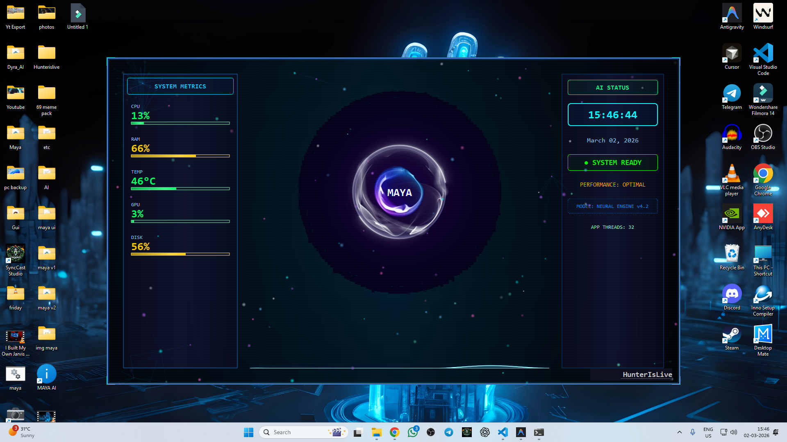

# Maya AI HUD - Futuristic Desktop Interface



A modern, futuristic HUD-style desktop monitoring application with real-time system metrics, audio visualization, and an AI-themed interface.

## 🚀 Quick Start (One-Click Launch)

### The Easy Way: `ui.bat`

Simply double-click **`ui.bat`** to launch the application. This script will automatically use the `.venv` virtual environment to start Maya AI HUD.

### Manual Launch

If you prefer to run it manually from your terminal:

```bash
# Activate your virtual environment
.venv\Scripts\activate

# Run the main script
python main.py
```

## Features

### 🎨 Visual Design
- **Animated Holographic & Quantum Backgrounds**: A stunning selection of futuristic backgrounds and animations.
- **Advanced Orb Visualization**: Centerpiece AI orb animation that reacts to the environment.
- **Smooth Transitions**: 60 FPS animations across the entire interface.
- **Futuristic UI Elements**: Multi-layer glow borders with color-shifting and corner accents.

### 📊 System Monitoring Panel
- **CPU & RAM Metrics**: Real-time bars indicating processing loads and memory usage.
- **Advanced GPU Monitoring**: Specialized detection of NVIDIA GPUs utilizing `pynvml` and `GPUtil`.
- **Temperature & Network Metrics**: Live updates for system temperatures and network upload/download speeds.
- **Color-Coded Status**: Dynamic progress bars that shift from green to yellow to red.

### 🎤 Microphone & Audio Visualizers
- **Colorful Gradient Waveforms**: Smooth visual animations representing frequency spectrums.
- **Speaker Audio Detection**: Works smoothly with headphones or system speakers.
- **Dynamic Response**: Neon-style glow effects based on volume levels.

### ⌨️ Controls
- **ESC key**: Closes the application cleanly.
- **Drag Window**: Click and hold anywhere on the HUD to move it around your desktop.

## Architecture

```text
maya ui/
├── main.py                 # Application entry point
├── ui.bat                  # One-click launch script
├── requirements.txt        # Python dependencies
├── ui/                     # User interface components
│   ├── main_window.py      # Main window housing background effects
│   ├── mic_visualizer.py   # Microphone and audio visualization
│   └── ...                 # Other UI panels
├── workers/                # Background threads for non-blocking UI
│   ├── audio_worker.py     # Captures speaker and mic audio
│   └── ...                 # Other workers (system, etc.)
├── effects/                # Dedicated visual effects modules loosely coupled with UI
└── utils/                  # Utility functions
```

## Installation & Setup

1. **Install Python 3.8+** (Ensure it is added to your PATH).
2. **Clone the repository** to your local machine.
3. **Open Command Prompt** in the project folder and set up a Virtual Environment:

```bash
python -m venv .venv
.venv\Scripts\activate
pip install -r requirements.txt
```

4. **Launch** the app by running `ui.bat`.

## Dependencies

The project relies on a few key libraries:
- **PySide6**: The core Qt6 GUI framework used to build the window.
- **numpy** & **sounddevice** / **pyaudiowpatch**: Used for capturing and mathematically processing audio for the visualizer.
- **psutil**, **GPUtil**, **pynvml**, **wmi**: Used for monitoring your system internals (CPU, RAM, GPU, and temps).

## Troubleshooting

### High CPU Usage
- Background animations are visually heavy. If running on a low-end system, you may experience frame drops or higher power consumption. 

### GPU/Temperature Reads 0
- Make sure your NVIDIA drivers are up to date and you have a dedicated NVIDIA GPU.
- Try running `ui.bat` as an Administrator.

### Audio Visualization Not Responding
- Ensure your output/input devices are set as the "Default Device" in Windows Settings.

## License

This project is provided as-is for educational and personal use.
